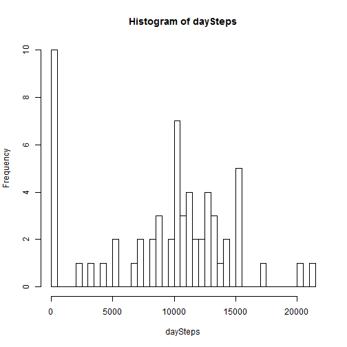
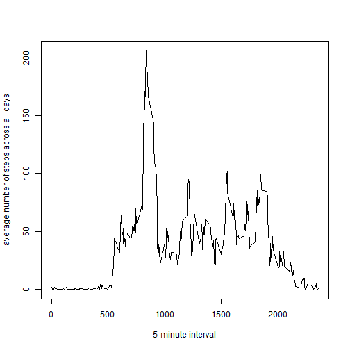
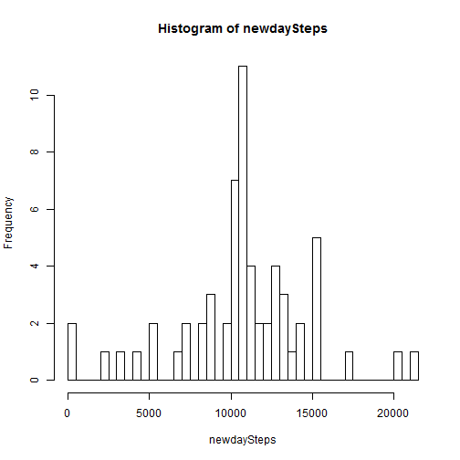
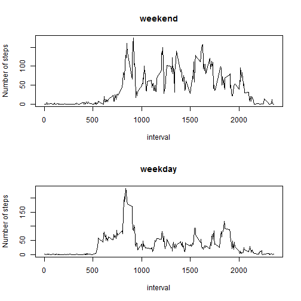

# Reproducible Research: Peer Assessment 1

Set global options.


Set the system locale to "English"


## Loading and preprocessing the data

Load the data.

```r
activityData <- read.csv("activity.csv")
```

Preprocess the loaded data.

```r
completeData <- activityData[complete.cases(activityData),]
```

## What is mean total number of steps taken per day?

Compute the total number of steps taken each day.

```r
dayData <- split(completeData, completeData$date)
daySteps <- sapply(dayData, function(x) sum(x[, "steps"]))
```

Make a histogram of the total number of steps taken each day.

```r
hist(daySteps, breaks=50)
```

 

Calculate and report the mean and median total number of steps taken per day.

```r
mean(daySteps)
```

```
## [1] 9354
```

```r
median(daySteps)
```

```
## [1] 10395
```

## What is the average daily activity pattern?

Make a new interval factored by 5-minute interval per day and add it to the data.

```r
completeData$newinterval <- factor(completeData$interval)
```

Compute the average number of the 5-minute interval of steps taken 
across all days.

```r
intervalData <- split(completeData, completeData$newinterval)
intervalaverageSteps <- sapply(intervalData, function(x) mean(x[, "steps"]))
```

Make a time series plot (i.e. type="l") of the 5-minute interval (x-axis) 
and the average number of steps taken, averaged across all days (y-axis).

```r
plot(x=levels(completeData$newinterval), y=intervalaverageSteps, 
     xlab="5-minute interval", ylab="average number of steps across all days", 
     type="l")
```

 

Which 5-minute interval, on average across all the days in the dataset, 
contains the maximum number of steps?

```r
names(which(intervalaverageSteps==max(intervalaverageSteps)))
```

```
## [1] "835"
```


## Imputing missing values

Calculate and report the total number of missing values in the dataset 
(i.e. the total number of rows with NAs).

```r
nrow(activityData[is.na(activityData),])
```

```
## [1] 2304
```


Create a new dataset that is equal to the origin dataset 
but with the missing data filled in with the mean for the 5-minute interval.


```r
for (i in 1:nrow(activityData)) { 
        if (!is.na(activityData$steps[i])) {
                activityData$newsteps[i] <- activityData$steps[i]
        } else {
                intervalname <- as.character(activityData$interval[i])
                activityData$newsteps[i] <- intervalaverageSteps[intervalname]
        }
}
```

Make a histogram of the total number of steps taken each day.

```r
newdayData <- split(activityData, activityData$date)
newdaySteps <- sapply(newdayData, function(x) sum(x[, "newsteps"]))
hist(newdaySteps, breaks=50)
```

 

Calculate and report the mean and median total number of steps taken per day.

```r
mean(newdaySteps)
```

```
## [1] 10766
```

```r
median(newdaySteps)
```

```
## [1] 10766
```


## Are there differences in activity patterns between weekdays and weekends?

Make a new date expressed by weekdays from the original date.

```r
activityData$newdate <- weekdays(as.Date(activityData$date))
```

Create a new factor variable in the dataset with two levels
 -"weekday" and "weekend".

```r
for (i in 1:nrow(activityData)) { 
        if (activityData$newdate[i] == "Saturday" | 
            activityData$newdate[i] == "Sunday" ) {
                activityData$newdate[i] <- "weekend"
        } else {
                activityData$newdate[i] <- "weekday"
        }
}
activityData$newdate <- factor(activityData$newdate)
```

Subset Weekend days.

```r
weekendData <- subset(activityData, newdate=="weekend")
```

Make a new interval factored by 5-minute interval per day and add it to the data.

```r
weekendData$newinterval <- factor(weekendData$interval)
```

Compute the average number of the 5-minute interval of steps taken 
across all weekend days.

```r
weekendinterval <- split(weekendData, weekendData$newinterval)
weekendintervalaverageSteps <- sapply(weekendinterval, 
                                      function(x) mean(x[, "steps"], 
                                                       na.rm=TRUE))
```

Subset Weekday days.

```r
weekdayData <- subset(activityData, newdate=="weekday")
```

Make a new interval factored by 5-minute interval per day and add it to the data.

```r
weekdayData$newinterval <- factor(weekdayData$interval)
```

Compute the average number of the 5-minute interval of steps taken 
across all weekday days.

```r
weekdayinterval <- split(weekdayData, weekdayData$newinterval)
weekdayintervalaverageSteps <- sapply(weekdayinterval, 
                                      function(x) mean(x[, "steps"], 
                                                       na.rm=TRUE))
```

Make a panel plot containing a time series plot of 
the 5-minute interval (x-axis) and the average number of steps taken, 
averaged across all weekday days or weekend days (y-axis).

```r
par(mfrow=c(2, 1))
plot(x=levels(weekendData$newinterval), y=weekendintervalaverageSteps, 
     main="weekend", xlab="interval", ylab="Number of steps", type="l")
plot(x=levels(weekdayData$newinterval), y=weekdayintervalaverageSteps, 
     main="weekday", xlab="interval", ylab="Number of steps", type="l")
```

 
